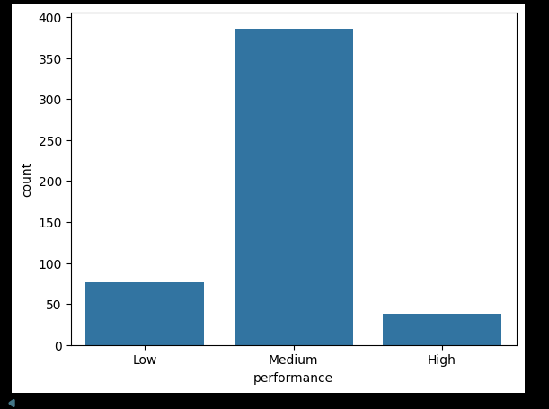
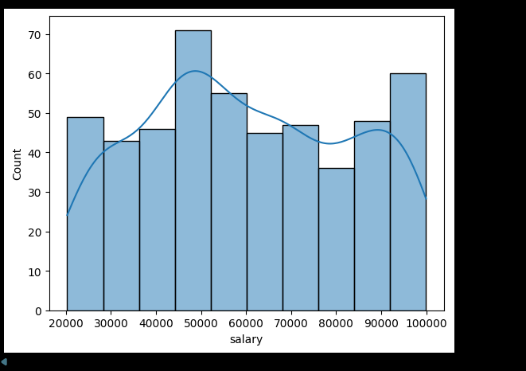
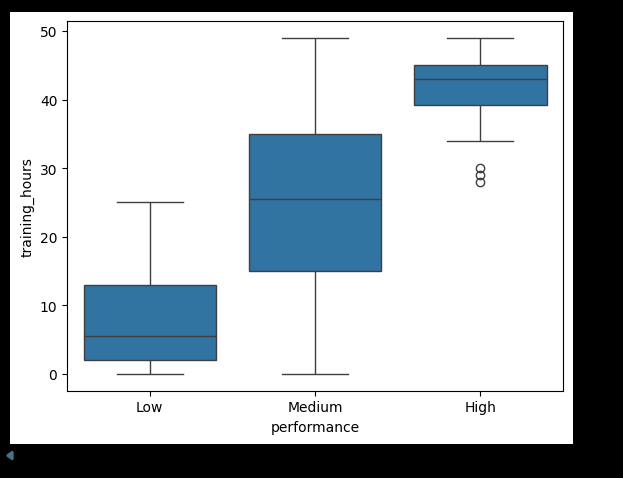
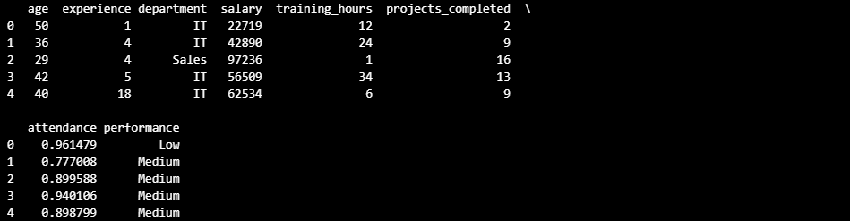
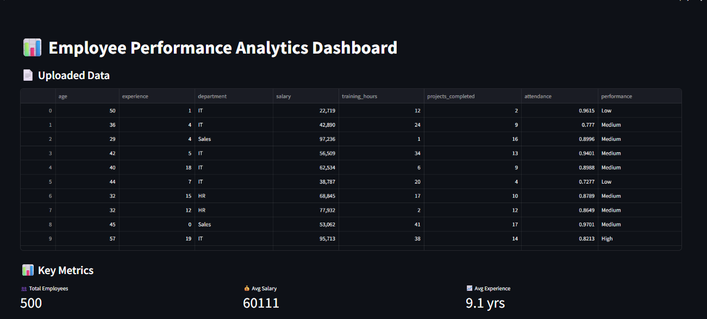
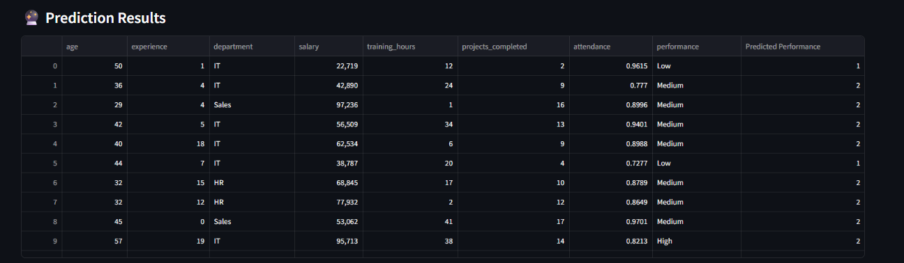
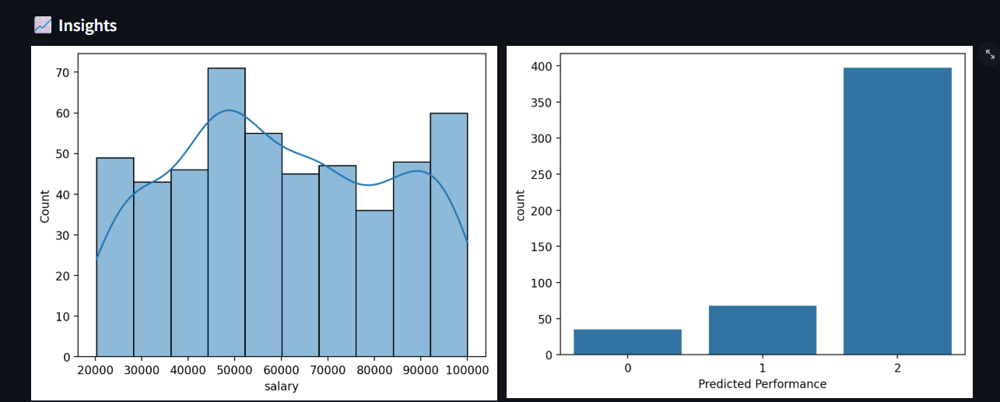
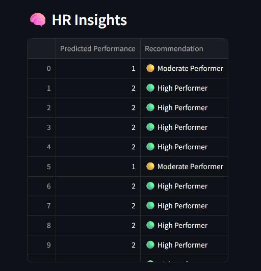

# Employee Performance Predictor

"Python" (https://img.shields.io/badge/Python-3.10-blue)
"Scikit-Learn" (https://img.shields.io/badge/Scikit--Learn-ML-orange)
"Streamlit" (https://img.shields.io/badge/Streamlit-App-red)
"Status" (https://img.shields.io/badge/Status-Completed-brightgreen)

## Project Overview

The Employee Performance Predictor is a machine learning-based system designed to analyze employee data and predict performance levels (High, Medium, Low).

## Problem Statement

Organizations often struggle to evaluate employee performance accurately due to large volumes of data and subjective decision-making. Traditional evaluation methods lack consistency, scalability, and data-driven insights.

## Solution

This project provides a data-driven solution that:

- Analyzes employee data using machine learning
- Predicts performance levels objectively
- Provides actionable HR recommendations
- Supports better decisions for training, promotion, and performance improvement

## Key Features

- End-to-end ML pipeline (Data → Preprocessing → Model → Prediction)
- Upload employee dataset via dashboard
- Interactive Streamlit dashboard
- Real-time performance prediction
- Visualization (charts and feature importance)
- HR recommendation system
- Downloadable prediction results

## 📈 Data Analysis & Model Results

## Sample Output

The system generates predictions along with actionable insights for each employee:

- Predicted Performance (High / Medium / Low)
- HR Recommendation based on performance
- Downloadable results file (CSV format)

## Tech Stack

- Python

- Pandas, NumPy

- Scikit-learn

- Matplotlib

- Streamlit

## Project Structure

Employee-Performance-Predictor/
│
├── data/
│   └── employee_data.csv
│
├── notebooks/
│   └── eda.ipynb
│
├── src/
│   ├── preprocessing.py
│   ├── model.py
│   ├── evaluate.py
│
├── models/
│   └── model.pkl
│
├── outputs/
│   ├── predictions.csv
│   └── results.txt
│
├── app/
│   └── app.py
│
├── main.py
├── requirements.txt
└── README.md

## 📊 Dashboard Preview

## How to Run the Project

1. Clone Repository

git clone https://github.com/your-username/Employee-Performance-Predictor.git
cd Employee-Performance-Predictor

2. Create Virtual Environment

python -m venv venv
venv\Scripts\activate

3. Install Dependencies

pip install -r requirements.txt

4. Run ML Pipeline

python main.py

5. Run Dashboard

cd app
streamlit run app.py

## Virtual Simulation

Employee Data → Preprocessing → Model Training → Prediction → HR Decision Making

- Low Performance → Training and monitoring
- Medium Performance → Skill improvement
- High Performance → Promotion and rewards

## Future Improvements

- SHAP-based explainability
- Advanced UI (filters, cards)
- Authentication system
- Cloud deployment

## Author

Nikhat Jahan

GitHub: https://github.com/Nikhatjahan85⁠�
